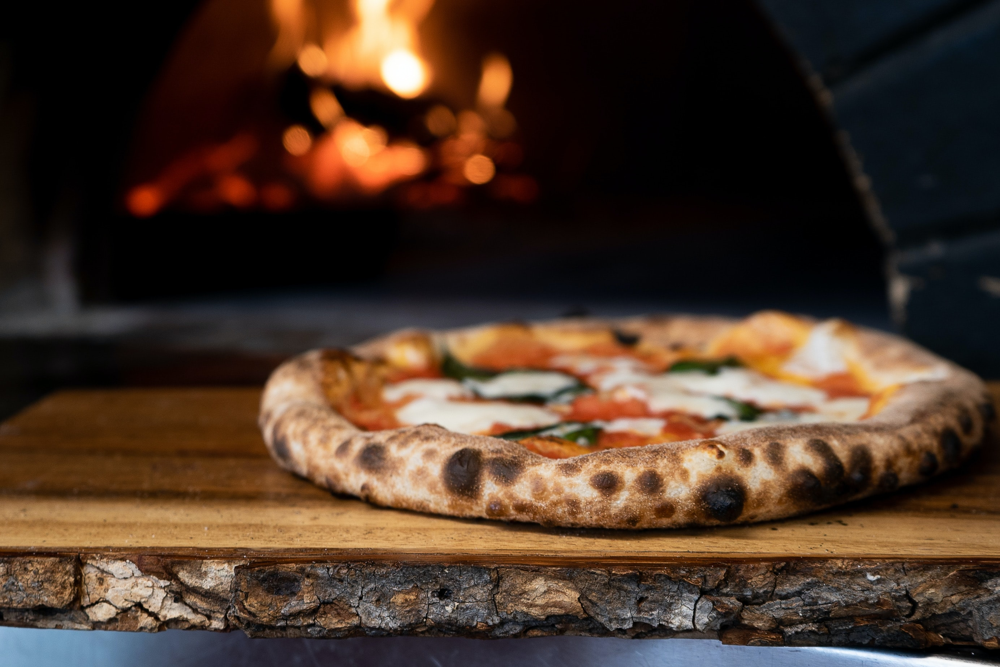
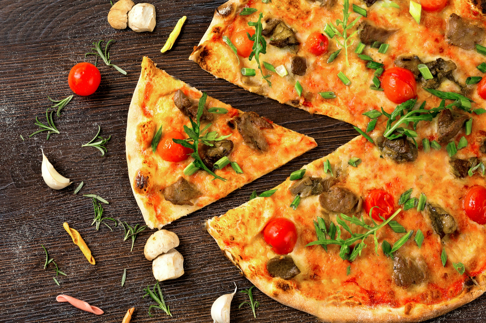
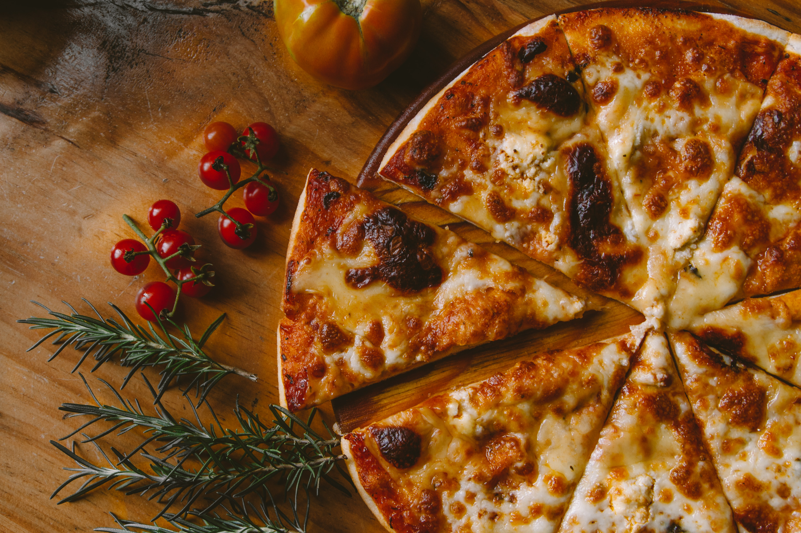
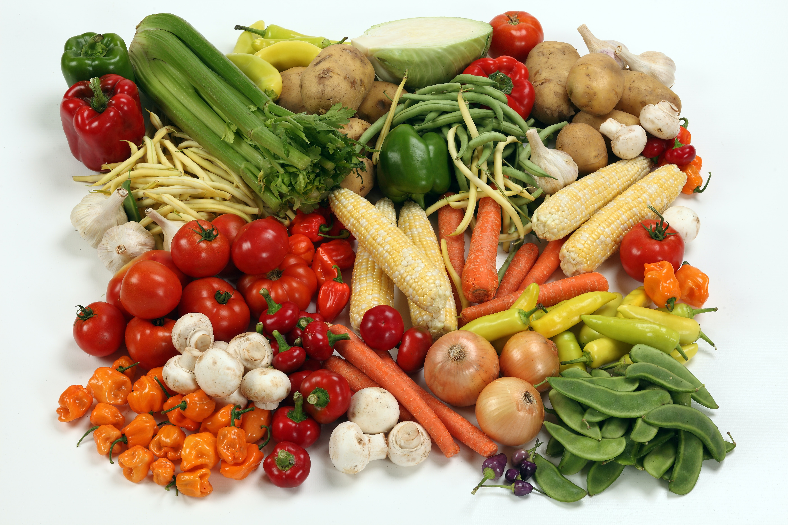
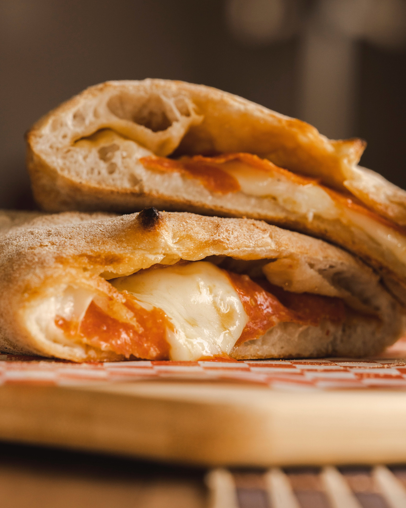
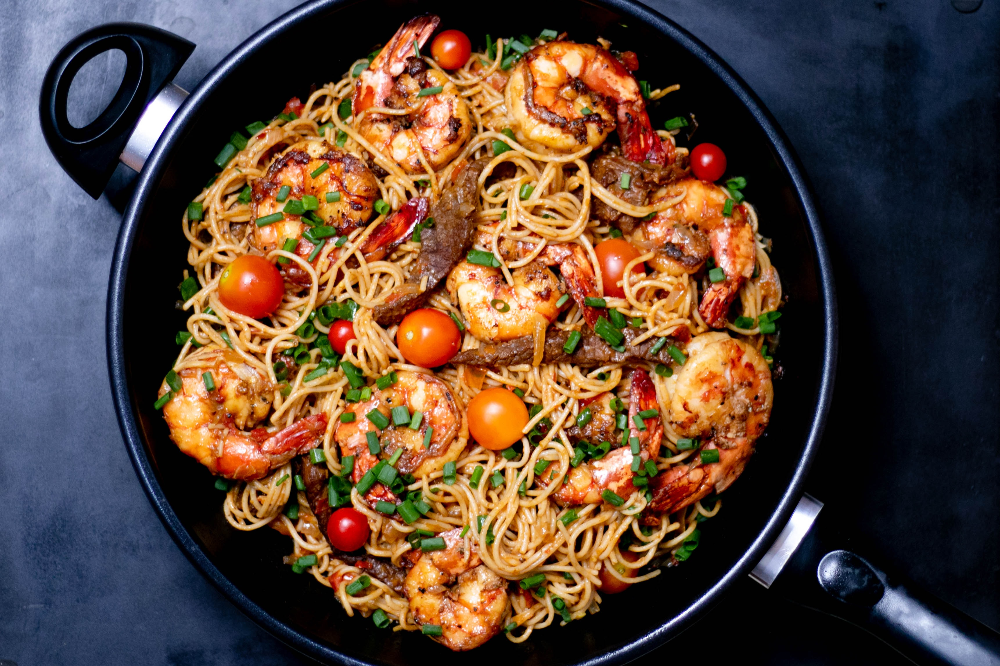
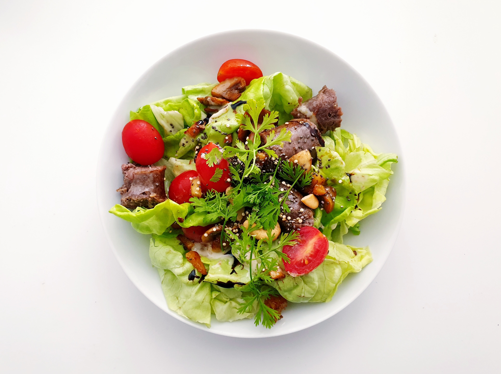
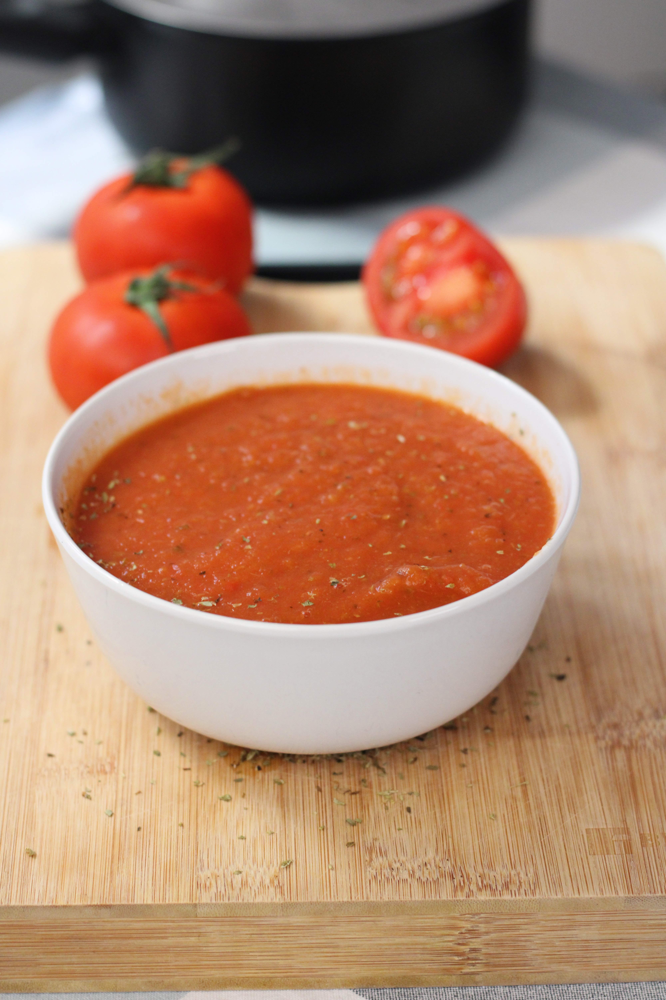
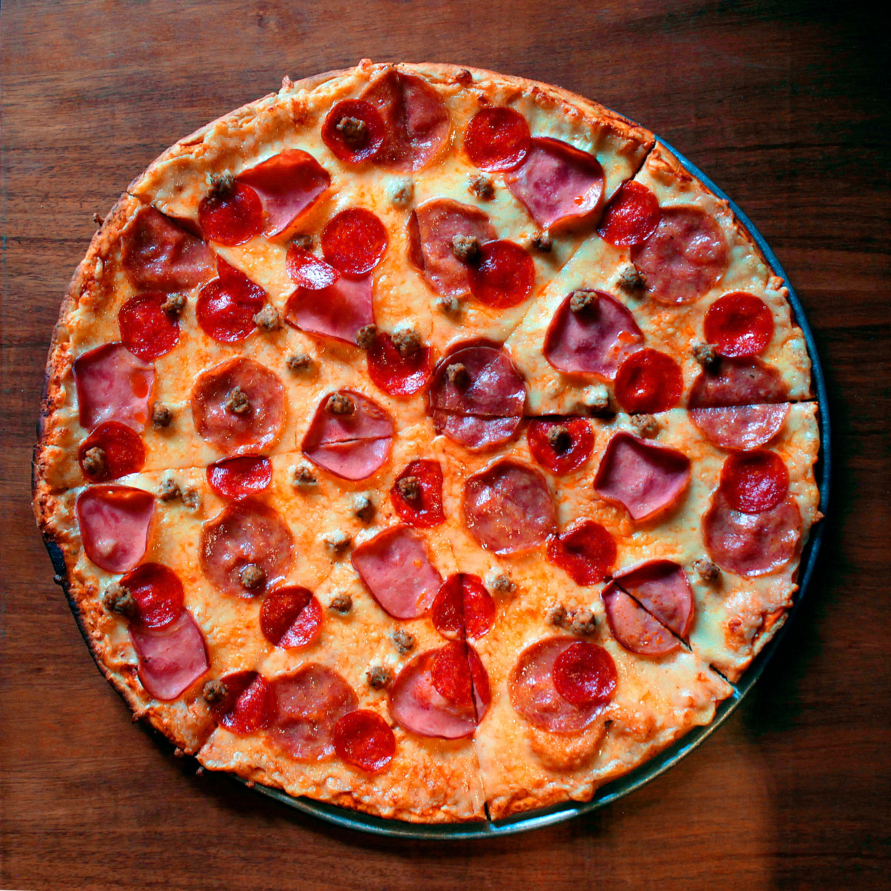

# Menu

---

## Pizze klasyczne

|Lp.| Pizza:                                                                           | rozmiar:           | 30 cm | 50 cm | 60 cm |
|---|----------------------------------------------------------------------------------|--------------------|-------|-------|-------|
|1. |MARGHERITA (sos pomidorowy, ser, oregano)                                         |                    | 20 zł | 40 zł | 49 zł |
|2. |FUNGHI (sos pomidorowy, ser, pieczarki)                                           |                    | 22 zł | 42 zł | 51 zł |
|3. |SALAMI (sos pomidorowy, ser mozarella, salami)                                    |                    | 23 zł | 43 zł | 52 zł |
|4. |VESUVIO (sos pomidorowy, podwójny ser , szynka)                                   |                    | 24 zł | 44 zł | 53 zł |
|5. |HAWAJSKA (sos pomidorowy, ser, szynka, ananas)                                    |                    | 25 zł | 45 zł | 54 zł |
|6. |MILANO (sos pomidorowy, ser, szynka, papryka, oregano)                            |                    | 26 zł | 46 zł | 55 zł |
|7. |KEBAB (sos pomidorowy, ser, kebab, sos czosnkowy)                                 |                    | 26 zł | 46 zł | 55 zł |
|8. |QUATTRO FROMAGGI (sos pomidorowy, 4 sery, oregano)                                |                    | 27 zł | 47 zł | 56 zł |
|9. |GRECKA (sos pomidorowy, ser, oliwki, feta, sałata lodowa)                         |                    | 28 zł | 48 zł | 57 zł |
|10.|BARBEQUE (sos pomidorowy, ser, kurczak, boczek, cebula, sos barbeque, oregano)    |                    | 30 zł | 50 zł | 59 zł |

---

## Pizze wegetariańskie 

|Lp.| Pizza:                                                                           | rozmiar:           | 30 cm | 50 cm | 60 cm |
|---|----------------------------------------------------------------------------------|--------------------|-------|-------|-------|
|1. |MARGHERITA (sos pomidorowy, ser, oregano)                                         |                    | 20 zł | 40 zł | 49 zł |
|2. |FUNGHI (sos pomidorowy, ser, pieczarki)                                           |                    | 22 zł | 42 zł | 51 zł |
|3. |HAWAJSKA VEGE (sos pomidorowy, ser, ananas)                                       |                    | 25 zł | 45 zł | 54 zł |
|4. |MILANO VEGE (sos pomidorowy, ser, papryka, oregano)                               |                    | 26 zł | 46 zł | 55 zł |
|5. |GRECKA (sos pomidorowy, ser, oliwki, feta, sałata lodowa)                         |                    | 26 zł | 46 zł | 54 zł |

---

## Pizza calzone

|Lp.| Nazwa:                                                                           | rozmiar:           | 30 cm | 50 cm | 60 cm |
|---|----------------------------------------------------------------------------------|--------------------|-------|-------|-------|
|1. |KEBAB (sos pomidorowy, ser, kebab, sos czosnkowy)                                 |                    | 26 zł | 46 zł | 55 zł |
|2. |GRECKA (sos pomidorowy, ser, oliwki, feta, sałata lodowa)                         |                    | 28 zł | 48 zł | 57 zł |
|3. |BARBEQUE (sos pomidorowy, ser, kurczak, boczek, cebula, sos barbeque, oregano)    |                    | 30 zł | 50 zł | 59 zł |

---

## Makarony

|Lp.| Nazwa:                                                               | porcja:            | 500 g | 650 g | 
|---|----------------------------------------------------------------------|--------------------|-------|-------|
|1. |SPAGHETTI NAPOLI (makaron z sosem pomidorowym i serem)                |                    | 30 zł | 49 zł | 
|2. |SPAGHETTI BOLONIA (makaron z sosem bolońskim)                         |                    | 20 zł | 45 zł | 
|3. |SPAGHETTI CARBONARA (makaron z sosem carbonara)                       |                    | 28 zł | 47 zł | 

---

## Sałatki

1. Cesar (sałata, cebula, oliwa z oliwek, pomidor) - 14 zł
2. Grecka (sałata, cebula, oliwa z oliwek, pomidor, oliwki, feta) - 19 zł
3. Hiszpańska (sałata, cebula, oliwa z oliwek, pomidor, oliwki, mozarella) - 24 zł

---

## Sosy

1. Czosnkowy - 4 zł
2. Pomidorowy - 4 zł
3. Barbeque - 4 zł
4. Sezamowy - 4 zł
5. Majonezowy - 4 zł

---

## Dodatki

1. Cukinia - 5 zł
2. Korczochy - 6 zł
3. Krewetki - 10 zł

---

## Napoje

|Lp.| Napój:                                                 | pojemność:         | 330 ml | 500 ml |
|---|--------------------------------------------------------|--------------------|--------|--------|
|1. |Woda                                                    |                    | 5 zł   | 10 zł  |  
|2. |Sok pomarańczowy                                        |                    | 7 zł   | 12 zł  | 
|3. |Sok jabłkowy                                            |                    | 7 zł   | 12 zł  |
|4. |Piwo jasne                                              |                    | 10 zł  | 15 zł  | 
|5. |Piwo ciemne                                             |                    | 12 zł  | 17 zł  |

---