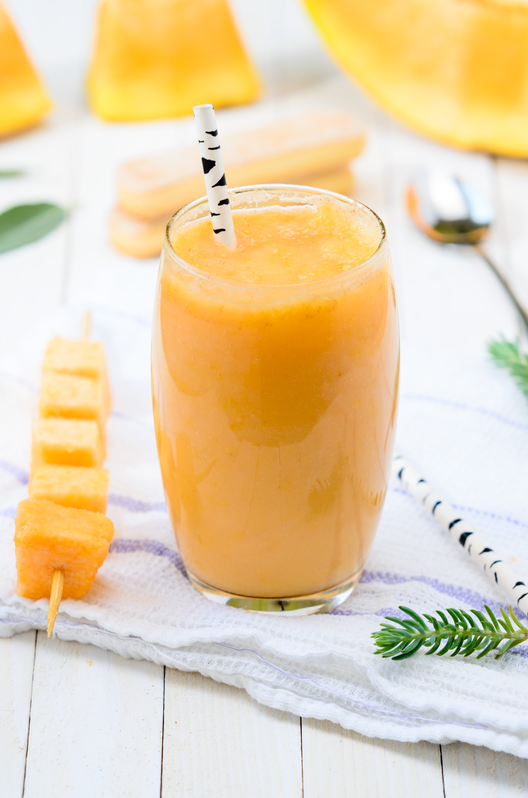

# Menu

---

## Pizze klasyczne

---

## Pizza calzone - zwinięta w pieróg

---

## Makarony

---

## Sałatki

---

## Sosy

---

## Dodatki

---

## Napoje

|Lp.| Napój:                                                 | pojemność:         | 330 ml | 500 ml |
|---|--------------------------------------------------------|--------------------|--------|--------|
|1. |Woda                                                    |                    | 5 zł   | 10 zł  |  
|2. |Sok pomarańczowy                                        |                    | 7 zł   | 12 zł  | 
|3. |Sok jabłkowy                                            |                    | 7 zł   | 12 zł  |
|4. |Piwo jasne                                              |                    | 10 zł  | 15 zł  | 
|5. |Piwo ciemne                                             |                    | 12 zł  | 17 zł  |

---